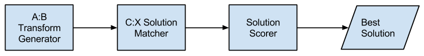
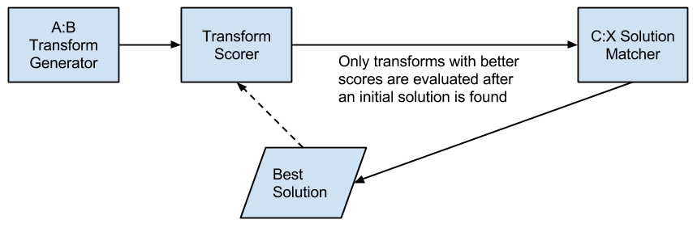

% Utilizing Generate and Test, Means-Ends Analysis, and Problem Reduction in Designing an AI Agent to Solve Raven's Progressive Matrices
% Magahet Mendiola
  (mmendiola3@mail.gatech.edu)
% January 25th, 2015

## Introduction

We will explore the concepts of Problem Reduction, Means-Ends Analysis, and Generate and Test in the context of solving RPMs (Raven's Progressive Matrices).

## Problem reduction

The concept of problem reduction is that a complex problem can be subdivided into multiple, simpler, problems. Humans do this quite naturally. For example, when preparing a meal, we do not expect to go directly from a pantry of raw ingredients to a Thanksgiving feast. We break down the overall goal into the set of dishes to be served. Each dish is then further divided into the phases of preparation and cooking required for each. Although thousands of individual actions may be required overall, we are able to easily, and naturally, deconstruct the problem into simple tasks.

In the case of developing AI agents to solve RPMs, problem reduction again provides a way to simplify the very complex overall goal. The task of solving RPMs could be decomposed the following way:

- Generate valid semantic networks for frames A and B.
    - Label objects in frame A
    - Create semantic network nodes and links showing spatial relationships between objects.
    - Label objects in frame B in each possible way
    - Complete the semantic network showing the transform links for each possible combination of transforms given the corresponding object labels.
    - Yield or store the generated semantic network for evaluation.
 
- Find the transformations that describe the relationship between C the answer choices.
    - Taking each generated semantic network representing the relationship between A and B, apply that transform to C.
    - Match the resulting figure X to each of the answer choices.
    - If a match is found, store the result along with the semantic network.

- Find the best weighted semantic network among those that describe the relationship between C and the answer choices.
    - Compute the sum of the weights of each valid semantic network.
    - Return the answer choice with the best sum of weights.

By breaking down the complex task of finding a solution to an RPM, the separate problems that remain are simple enough to handle with naive processes. This methodical approach to problem solving also simplifies the conceptualization of the solution. This makes the task of engineering an AI agent simply a matter of coding modular components to reach each of these sub-goals; then to design interfaces between each component to hand off the current state of the solution to the next modular component.

## Generate and Test

Generate and Test is a methodology for problem solving which involves the creation of possible solutions and the evaluation of these to test their viability as the correct answer. This process requires two components; the first is the solution generator, which creates possible solutions based on an application specific set of rules. The second component is the tester, which compares each generated solution against application specific criteria in order to determine whether a given answer is correct.

We can utilize Generate and Test all throughout the design of our RPM agent. From the previous breakdown of our agent's tasks, we notice that the first main process is to generate valid semantic networks to describe the relationship between frames A and B. We can think of this sub-task as a generator of transformation descriptions. These descriptions are then tested, in the second main sub-task, against the figures in C and each of the answer choices.

The second sub-task of our agent would take these generated semantic networks and apply them to frame C. The resulting figure would be compared to each of the answer choices. Each match would be considered a generated possible solution. These solution transforms would then be passed to the final sub-task, which would compute the weighted value of the transform. This design separates the creation of candidate solutions and the evaluation of those solutions against a defined metric. Separating the process of creating and testing solutions allows us to break down the problem further into modular and simplistic functions. In this regard, Generate and Test can be considered a form of Problem Reduction.

## Means-Ends Analysis

Means-Ends Analysis is the concept that complex solutions can be found incrementally, by taking small steps and evaluating whether you have moved closer to the final goal. There are many examples of this methodology, including A* path-finding and hill-climbing optimization.

A* uses a heuristic that evaluates whether a given movement (the means), would bring us closer to the goal position (the ends). As the algorithm runs, it searches the landscape for the most direct path to the goal. This reduces the number of positions the algorithm needs to evaluate by focusing on those positions that bring us closer to the goal. We see an example of this in figure 2.

Hill-climbing, likewise, takes incremental steps in the feature space and performs an evaluation of whether the change had a positive or negative effect. Means-Ends is a powerful methodology in solving complex problems incrementally. It can be thought of as a method of problem reduction in that it reduces a complex problem, like finding a safe path through rough terrain, into a simpler problem of finding how to reach a very nearby point that happens to be incrementally closer to the final goal.

As we can see in figure 3, hill-climbing, and by extension Means-Ends Analysis, has the caveat of local optimums. This is a position that could be discovered by moving incrementally towards what appears to be the best solution, but is only optimal in the local feature space. We have to be aware that these exists and prepare to design mechanisms to mitigate the trap, such as random restart in the context of hill-climbing.

In our RPM problem solving agent, Means-Ends Analysis can be utilized in a number of ways. First, as we generate semantic networks in the A:B transform generator, we can reduce the number of transforms to evaluate by rejecting those that have a weighted score worse than the current best solution. This will require running the scorer after the initial transform generator instead of after the transform has been matched to a solution choice. This trade-off will have to be evaluated based on performance gains, but it seems more efficient to disregard transforms before they are evaluated against frames C and the answer choices. This supposes that the computational cost of scoring transforms is lower than applying those transforms to C and matching against the candidate figures.

Means-Ends Analysis can also be used in the transform generator itself by coding it to create semantic networks using the best weighted transforms first. This preference for simpler transforms guides the agent toward the optimal solution. This could be quite important as a time-constrained agent would limit it's evaluation of the solution space. Like hill-climbing optimization, we can escape the process early and still be left with a strong final answer choice.

## Conclusion

The concepts we've covered have many inter-related facets. We've seen that both Means-Ends Analysis and Generate and Test can be thought of a specific ways of performing Problem Reduction. They each break down the problem into smaller, more manageable, components.

We have also seen that in designing our RPM agent to use Generate and Test, we created a generator that prefers solutions that improve our weighted transform score. Thus our generator is performing Means-Ends Analysis internally, which illustrates how these concepts work in concert with one another to simplify the process of creating a robust AI agent.

Finally, we should remember that the more general concept of Problem Reduction made the modular analysis of each stage of solving RPMs more manageable and easier to conceptualize. Designing and AI agent to perform these simplified set of tasks is far less daunting than approaching the problem holistically.
