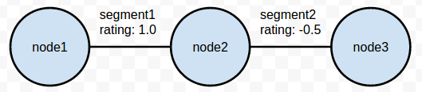
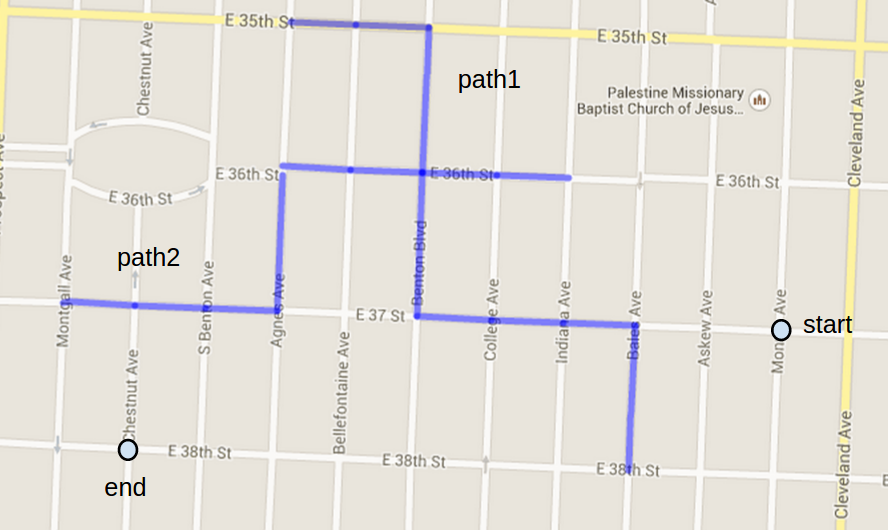
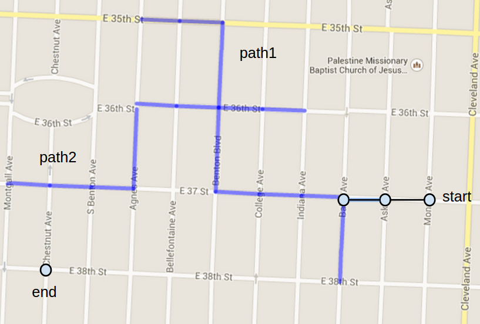
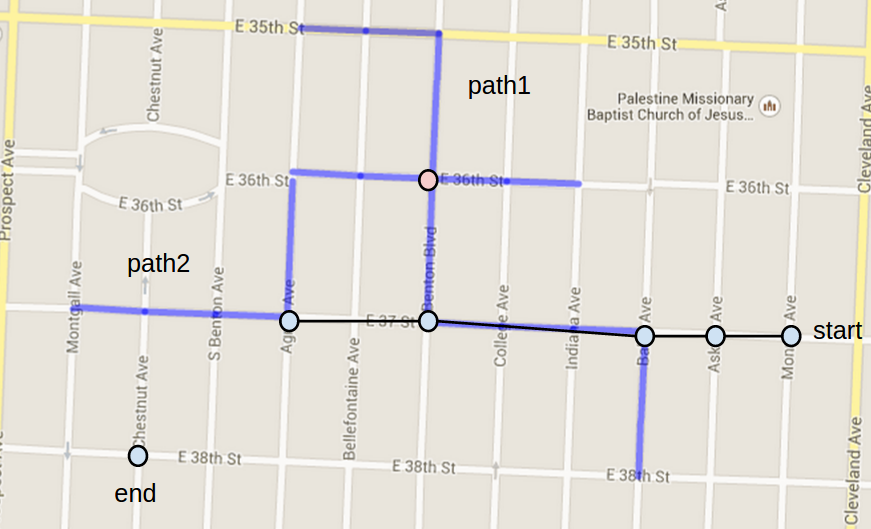
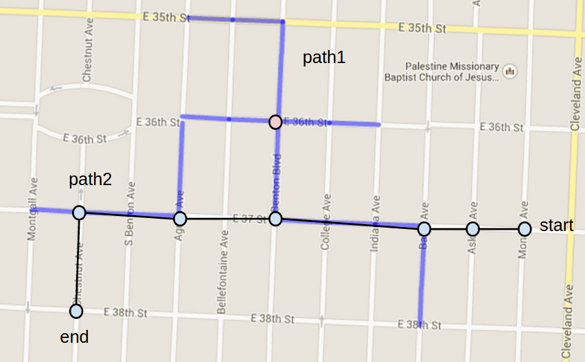

% Hybrid Path Routing with Shortest Path and Case Based Reasoning
% Magahet Mendiola
  (mmendiola3@mail.gatech.edu)
% March 10th, 2015
\makeatletter
\def\verbatim{\small\@verbatim \frenchspacing\@vobeyspaces \@xverbatim}
\makeatother

## Introduction

We will design a route planner that is capable of utilizing previously recorded cases to reduce the effort of path finding as well as to find high quality routes based on preference data associated with each case. Our planner will be flexible enough to use multiple cases that share only partial route segments with the final computed path. This will be accomplished by adding heuristic to classic shortest path routing to retrieve and adapt stored cases of previously computed routes.

Our planner will also utilize user ratings data to refine known paths by setting an affinity for route segments with better average user ratings. The knowledge representations and algorithms required to accomplish these goals is outlined in the following sections.

## Knowledge Representation

### The Map

The map datastore would consist of a graph database with intersections as nodes and road segments (sections between intersections) as edges. Each such node would be referenced by internal index to the preferred route datastore. Each edge would also include quality metadata represented as a moving average score in some arbitrary range (e.g. -1.0 to 1.0). The map database will also facilitate running shortest-path algorithms such as A* against partial or full sections of the desired route. Here is an example representation of the map database:

### Preferred Route Cases

These records would include the full path of each preferred route indexed with an arbitrary key. Routes would be stored as a set of map segment indexes from the map graph database. New preferred route cases would be recorded when a user submits positive feedback regarding a route. When this happens, the route would be added to the preferred path datastore if it doesn't yet exist. The following is a contrived example of a preferred route entry:

    path1:
        {node1, node2, node3, ...}

In order to facilitate the use of preferred path routes when a new request is made, we must also maintain a reverse index for preferred paths. This would consist of each node in a given path with a value that matches that of the full path's key:

    node1:
        {path1}
    node2:
        {path1}
    node3:
        {path1}

The routing algorithm will use these three sources as it's working memory to provide both route caching and rerouting based on route ratings. The algorithm for route retrieval, evaluation, and adaptation is describe in the following sections.

## Routing Algorithm

### Shortest Path Fall-Back

The routing algorithm will default to classic A* search along the directed graph from the start to end nodes. However, once a specific route has been planned, that route will be added the preferred routes set.

### Sub-Route Caching

During the A* search, if a current node is found in the node to paths table, the route planner will then only evaluate neighbors that are in the matching preferred path's node set. This restricted A* search will essentially follow the preferred path exactly. Once in this state of following the preferred path, the algorithm will strictly watch the heuristic score (euclidean distance to end node) for each evaluated node.

### Sub-Route Escape

If the heuristic score monotonically increases for too many evaluations, we can consider the preferred path too far away from the end node. Once our planner reaches this threshold, it will begin an unrestricted A* search from the current node (lowest f score) to the end node.

### Recurring Sub-Route Caching

If this search were again to find a node that links to another preferred path, it would again restrict it's search based on the path node set.

### Storage

Once the end node is reached, the full path is added both to the preferred path set and the node to path table.

## Segment Ratings

When a user rates a given path, each segment in that path will have it's rating updated in the map database. This will be performed using an appropriate moving average. The concept would be to use each segment's rating score and the segment's length together in A*'s cost function. This would provide an affinity, during the search, for segments with better average ratings.

### Preferred Route Updating

During the process of following the currently trigger preferred route, the route planner may encounter segments with negative ratings. We could allow A* search to break from the preferred route in such cases. If the planner were then to reconnect with the same preferred path at a later point, the rerouted section could be updated in the existing preferred path.

Using this added heuristic, we would also allow for cases where a given preferred path could be updated when traveled multiple times, while still providing caching benefits to the planner.

## Example route planning

We start with the set of known paths and a new request with start and end nodes. These can been seen in figure 2.

The planner begins by doing A* based on segment distance and ratings. Once a node is found on an existing path, it begins to follow that path. This is shown in figure 3.

At some point, the path leads away from the end node, causing the planner to abandon the path and restart A* from the closest point. This again finds a different path. The planner will now follow this path toward the end node. See figure 4.

Eventually this second path leads away again. The remainder of the path planning will be done with A*, again from the closest point.

Unrestricted search only occurred for three small segments of the complete path. The remainder was handled by simply following previously learned cases of positively rated routes. The final route is shown in figure 5.

