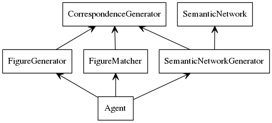

% AI Agent to Solve 2x1 Visual Analogy Problems
% Magahet Mendiola
  (mmendiola3@mail.gatech.edu)
% January 31th, 2015


## Introduction

We will describe the design of an AI agent built to solve 2x1 visual analogy problems. This will include details on the agent's architecture, design trade-offs, performance, and further improvements.


## Architecture

The overall design goal of the agent is to represent the visual analogy between frames A and B in a way that can be computationally applied to frame C and matched against the given answer choices. To perform this, we can break down the agent's tasks in the following way:

- Generate valid semantic networks for frames A and B.
    - Generate correspondence maps for objects in frame A and frame B
    - Create semantic network nodes and links describing the spatial relationships between objects in each frame.
    - Create links describing the transformations between corresponding objects in each frame.
    - Compute the complexity of the semantic network.
    - Pass each semantic network on to the next task.
 
- Generate figures from figure C using each provided semantic network.
    - Generate correspondence maps for objects in the semantic network and frame C.
    - Apply semantic network transformations to each object.
    - Change spatial relationships to those described in the semantic network.
    - Pass each figure on to the next task.

- Find the best match between each provided figure and the answer choices
    - Generate correspondence maps for objects in frame C and each answer figure.
    - Compare the resulting figure to each of the answer choices.
    - Pass the closest matching figure and the answer choice it matches to the next task.

- Store the current best answer choice.
    - Disregard the answer if it's matching score is worse then the current best.
    - Disregard the answer if it's semantic network is more complex than the current best.
    - Disregard the answer if the generated figure matches the semantic network spatial relationship less than the current best.
    - Save the answer and all scoring types as the current best.

- Return the current best answer choice.
    - Return when all combinations of semantic networks, generated figures, and possible answer matches have been evaluated.
    - Return the current best answer if the timeout expires.
    - Return a random guess if no candidate answers were found.

To distribute these task into modular pieces, the agent is divided into the following components:



Figure 1 depicts the separate components which handle each sub-task involved in solving the problem. We will explore the function and relationship of each in the following sections.


### Correspondence Generator

The correspondence generator is a generic utility which takes two lists of objects and creates every possible mapping between them. This is utilized by the generators for semantic networks, figures, and answer matches. Although it iterates through every possible object correspondence, it cannot be considered a strong generator since it does not include any logic regarding what mappings it yields. This is left to the logic within the more specific generators.


### Semantic Network Generator

The agent begins by instantiating the semantic network generator, which creates and yields each valid variation of semantic networks. These each describe the spatial relationship between objects in frames A and B, as well as the transformations of those objects between the frames.

It performs this task by first calling the correspondence generator to create every possible mapping between each object in the two frames. These object mappings are provided to the semantic network class to create the knowledge representation. This semantic network is then yielded back to the agent.

Before the generator continues with a new object mapping, it yields each alternative semantic network that could be created from the current mapping. These alternatives include cases where object transitions can be described in multiple ways, such as by a rotation or a reflection.


### Semantic Network Model

The knowledge representation is created by first inspecting the spatial relationships between objects in each frame. This is done by extracting the values from each object's spatial relationship attributes and remapping those values with the object labels used in the semantic network. Relationships from both frames A and B are parsed and stored.

The network then iterates through the object mappings provided and parses the transformations each object requires to become their corresponding object in frame B. Each non-spatial attribute is taken from the object in each frame and provided to a specialized hander function for each attribute type. These handlers determine the transformation required to change an attribute from one value to another. As an example, this handler describes the transformation for an object whose angle attribute changes from one frame to the next:

```
def angleChange(self, before, after):
    if before != after:
        return ('rotate', int(after) - int(before))
```

### Figure Generator

The agent takes each semantic network generated and passes it to the figure generator. This utilizes the correspondence generator to iterate through every possible mapping between the objects represented in the semantic network and those in figure C. Each of these mappings is used to create a candidate figure X. This figure is created by applying the semantic network transforms on figure C, and by applying the spatial relationships stored in the semantic network that described frame B.

The figure generator also includes logic to create a score for how well figure C, with each object mapping, matches the spatial relationships observed in figure A. This allows the agent to prefer answers that are derived from figures that most closely match the semantic network spatial representation. The agent is also more robust to cases where perfect matches are not possible between spatial relationships in figures A and C.


### Figure Match Finder

Once the agent has a candidate figure X, it passes this to the figure match finder. The match finder compares figure X to each of the answer choices and returns the closest match.

The correspondence generator is again used to create object maps from figure X to a given answer frame. These object maps are then used to score the difference between objects in each figure. These scores are created by summing the set of attributes that do not match between each object. The best total score from each object mapping is returned to figure matcher, which in turn passes the best scoring figure from the answer choices along with the matching score back to the agent.

Since the figure matcher returns an answer even in cases where a perfect match is not found, the agent is able to make well informed guesses without accounting for every possible transformation and relationship in and between the figures.


## Performance

The main contributer to the time complexity of the agent, as it is currently designed, is the number of object mappings to consider. The number of mappings is equal to $n!$, where $n$ is the number of objects in the figure or network with the greater number of objects. The full set of object mappings is considered in three phases of the agent's problem solving process: 

- semantic network generation
- figure generation
- figure matching

Figure matching iterates through each object mapping for each answer choice. Without heuristics for discarding many of these generated networks and figures, the total number of object mappings created is nearly an order of magnitude greater. A few of these are implemented, such as the agent's timeout rule; this stops the evaluation of the problem after a set amount of time and returns the current best answer.

The fact that the number of objects in 2x1 visual analogy problems is limited makes this design practical; however, problems with just five objects in each figure begin to introduce a noticeable delay in problem solving. Once the agent is adapted to larger grid problems, the time complexity of the correspondence generators will become more of an issue.


## Further Improvements

There are many intricate spatial relationships and transformations that are obvious to a human observer, but are not captured by the current agent. Figure 2 shows an example problem that cannot be solved with the current agent's design.


Improvements to the agent should include representations for modeling relationship between individual objects, such as comparing the number of sides and angles between corresponding objects.

There are also many problems that require the application of transformations to objects that are in figure C but not in figures A and B. Another improvement would be to design a method for generating additional figures based on these implied transformations.

Finally, spatial relationships become complex when whole figures are rotated or flipped. Human observation is robust enough to account for such situations; however the current agent is unable to reorganize the intra-figure spatial relationships after such transforms.

Each of these special considerations require more complex strategies for modeling the spatial and transformation relationships. They also require more sophisticated processes for evaluating these relationships without introducing significant increases in the number of figures and semantic networks to consider.
