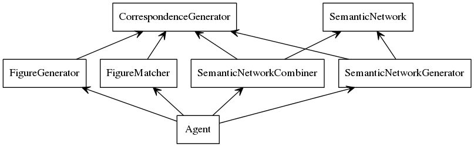

% AI Agent to Solve 2x1 and 2x2 Visual Analogy Problems
% Magahet Mendiola
  (mmendiola3@mail.gatech.edu)
% February 21st, 2015


## Introduction

We will describe the design of an AI agent built to solve 2x1 and 2x2 visual analogy problems. This will include details on the agent's architecture, design trade-offs, performance, and further improvements.


## Architecture

As with the earlier version of our agent, which only solved 2x1 problems, the goal remains the same with our expanded agent. In 2x1 problems we need to represent the visual analogy between frames A and B in a way that can be computationally applied to frame C and matched against the given answer choices. In 2x2 problems, we modify this process significantly. First, instead of deriving a single semantic network, we need to create two; One network will describe the transform from A to B, while the second will describe the A to C transform. In order to create the candidate figure to be matched against the answer choices, we have to apply both transforms to figure A. To accomplish this, we must perform the following (task details have been removed except for new components):

- Generate valid semantic networks for the A to B transform and the A to C transform.
 
- Generate combinations of the A:B and A:C semantic networks.
    - Generate correspondence maps for objects in each network.
    - Using the object correspondence maps, merge the two semantic networks.
    - Generate and pass alternative networks derived from each object mapping to the next task.

- Generate figures from source figure (A for 2x2, C for 2x1) using each provided semantic network.

- Find the best match between each provided figure and the answer choices

- Store the current best answer choice.

- Return the current best answer choice.

To distribute these task into modular pieces, the agent is divided into the following components:



Figure 1 depicts the separate components which handle each sub-task involved in solving the problem. We will explore the function and relationship of each in the following sections.


### Correspondence Generator

The correspondence generator is a generic utility which takes two lists of objects and creates every possible mapping between them. This is utilized by the generators for semantic networks, figures, and answer matches. One significant change was made from the previous agent's correspondence generator. The new version creates object matches between lists of differing sizes and creates mappings that include the possibility that objects from each list have been added and removed. The following shows two lists and a sample of what the new generator would create:

```
list1 = [1, 2]
list2 = [3]

objectMaps = [
    [(1, 3), (2, None)],
    [(1, None), (2, 3)]
]
```

This allows the agent to consider cases where the number of objects does not match between two lists.


### Semantic Network Generator

The semantic network generator creates and yields each valid variation of semantic networks. These each describe the spatial relationship between objects in source and target frames, as well as the transformations of those objects between the frames.

Before the generator continues with a new object mapping, it yields each alternative semantic network that could be created from the current mapping. These alternatives include cases where object transitions can be described in multiple ways, such as by a rotation or a reflection. 

Additional edge case handling has been added to the alternative network generator to account for specialized cases of reflection. These include the handling of shapes with special reflection characteristics, such as Pac-Man and right-triangle. These special shapes require an understanding of the relationship between the object's rotation angle in each frame to determine if the transition can be considered a horizontal or vertical reflection.


### Semantic Network Model

The base semantic network object has been modified to include the original object attributes in each figure. This is required in some instances when the Semantic Network Combiner is trying to resolve conflicts regarding what transformations should be applied to the source figure. These issues arise from the handling of 2x2 problems, whereas 2x1 problems remain straightforward in applying the semantic network transforms.

### Figure Generator

Using the correspondence generator, the figure generator iterates through possible mapping between the objects represented in the semantic network and those in source figure (C in 2x1, A in 2x2). Each mapping is used to create a candidate figure X by applying the appropriate transforms to the corresponding objects in the source figure.

In order to handle certain edge cases involving reflections, this generator has been modified to apply the appropriate angle adjustments for specific shapes. For example, the following code applies the vertical-flip transform to Pac-Man shapes:

```
def verticalFlip(figObj, value):
    # pacman
    if figObj.get('shape') == 'Pac-Man':
        if 'vertical-flip' in figObj:
            del figObj['vertical-flip']
        if figObj.get('angle') == '45':
            return ('angle', '315')
        elif figObj.get('angle') == '135':
            return ('angle', '225')
        elif figObj.get('angle') == '225':
            return ('angle', '135')
        elif figObj.get('angle') == '315':
            return ('angle', '45')
```

### Figure Match Finder

Once the agent has a candidate figure X, it passes this to the figure match finder. The match finder compares figure X to each of the answer choices and returns the closest match.

Since the figure matcher returns an answer even in cases where a perfect match is not found, the agent is able to make well informed guesses without accounting for every possible transformation and relationship in and between the figures.


## Performance

As with the previous version of the agent, the main performance limitation is based on the number of object mappings to consider at each stage of the evaluation process. An exponential growth occurs in the number of generated figures, as object correspondence maps are created at each of the following stages:

- semantic network generation
- semantic network combining
- figure generation
- figure matching

Even with the limited number of objects in most 2x2 problems, the number of generated networks, combined networks, and figures explodes quickly. In addition, without a more intelligent method for combining semantic networks, many of the generated figures are identical.

## Further Improvements

Given the time-complexity involved in analyzing all possible object mappings at each stage, it would help to reject a number of these mappings as too complex to be considered. For example, given any two figures we can consider that all the objects were removed from the source and all new objects are added to the target. Although this is a strictly legal transformation, it does not reflect the common behavior of a human test taker. It could also be worthwhile to further evaluate final solutions based on the complexity of all the various object mappings required to deduce the given answer.

As with 2x1 problems, there are problems that require the application of transformations to objects that are in one of the example target frames but not in the other. For example, the problem in Figure 2 requires the addition of two objects and that the transformation applied to the original object should also be applied to these new objects.


Finally, complex spatial relationships still elude this implementation of the agent. When whole figures are rotated or flipped, the current agent is unable to reorganize the intra-figure spatial relationships.

Both 2x1 and 2x2 problems require complex strategies for modeling the spatial and transformation relationships. In addition, 2x2 problems introduce the real problem of limiting the complexity of object mapping between each stage of the process.
